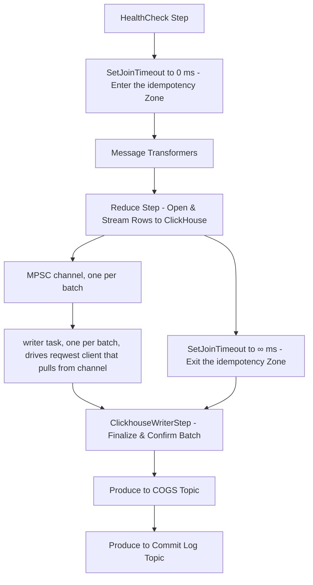

# rust-snuba consumers

Snuba has two ways to ingest data into clickhouse: The old, Python-based consumers, and this Rust consumer.

This document is about the Rust one, but due to it starting out as a
line-by-line port of the Python consumer, the higher-level architecture also
applies to Python.

## Entrypoint

`rust_snuba` is a library crate that is being compiled with PyO3/maturin into a
Python wheel. This Python wheel exposes a `consumer` function which is used
from within the Snuba (Python) CLI to launch `snuba rust-consumer`.
Configuration parsing, CLI parsing and runtime config are still handled in
Python so as to avoid unnecessary code duplication and potentially multiple
sources of truth for config.

## Steps

`rust_snuba` then uses the Rust port of Arroyo to define its own consumer. The following steps (processing strategies) exist (see `factory.rs`):

1. `HealthCheck` step, touches a file in irregular intervals to signal to k8s
   that the consumer is still alive.
2. `SetJoinTimeout` step, resets the join timeout to 0 for the next steps. This
   marks a section where it's ok to drop in-flight progress during rebalancing.
3. Message transformers, basically a threadpool to parse messages, validate
   them and turn them into rows. This can call both back into Python code for
   when the MessageProcessor hasn't been ported to Rust yet, but most datasets
   have a Rust-native processor.
4. `Reduce` opens batches by opening a connection to clickhouse, and writes
   rows into them one-by-one. There is only one batch at a time, and the size
   of a batch is constrained by `--max-batch-time-ms` and `--max-batch-size`.
5. `SetJoinTimeout` is reset to "no timeout" here. Between this and the
   previous section, everything will be dropped by Arroyo during rebalancing as
   parsing and validating messages has no side effects. Even sending data to
   ClickHouse is idempotent for as long as the batch is not closed.
5. `ClickhouseWriterStep` is responsible for closing batches. It takes a batch
   from the previous step, signals to ClickHouse that the batch is done, and
   waits for ClickHouse to return 200 OK.
6. COGS and commit log are two topics we produce metadata into once we're done
   writing to ClickHouse, but they are typically not relevant for performance.

## Batching

ClickHouse can only deal with a very low rate of inserts. You might have heard
it can only handle 1 INSERT/s, but that is more of a rule of thumb.

Since we have many consumer replicas inserting into each ClickHouse cluster, we
need to calculate each consumer's batch size and time according based on
replica count. For example, if we have 12 replicas, each consumer may only
insert once every 12 seconds (`--max-batch-time-ms=12000`), so that on average
there is one insert per second. In the ops repo this parameter is abstracted
away with `batch_time_per_replica`, which is typically 1000 (ms).

At a lower level, batching is done using a custom reduce state. Every time a
new batch is opened, a new `BytesInsertBatch<HttpBatch>` is constructed, which
opens a connection to ClickHouse when the first row is written.

The `HttpBatch` internally uses the `reqwest::Client` to stream data into
ClickHouse. `reqwest` asks for a stream type, so we create a bounded channel.
The receiver belongs to reqwest and we use the sender in `write_rows` to write
chunks of many rows into the channel. This indirection exists mostly because it
is more ergonomic for us to be able to call a function to write more data to
ClickHouse, but reqwest wants an interface where it can pull data out of.

This design allows the consumer to open very large batches that do not fit into
consumer memory. Even in lower-scale datasets the memory savings are pretty
huge.

Known issues:

* If the `ClickhouseWriterStep` exerts backpressure on the previous step, it
  can theoretically happen that `Reduce` is unable to flush its own `HttpBatch`
  in a reasonable timeframe. This means that there is an idle connection
  lingering around in `Reduce`, and ClickHouse may close it because of that
  idleness, causing the consumer to crash after e.g. 30 seconds of it being
  stuck.
* There can be backpressure between writing a row into the channel and sending
  it to ClickHouse. If this backpressure continues for a very long time, the
  consumer will panic instead of exerting backpressure further. So far this has
  never happened.

